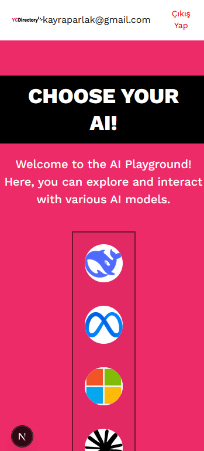

```markdown
# AI Orchestrator

AI Orchestrator is a powerful tool designed to manage and interact with multiple AI models and APIs. It provides a seamless interface for users to explore, test, and utilize various AI capabilities in a unified platform.

## Features

- **User Authentication**: Secure login and registration system using `NextAuth.js` and JWT.
- **AI Model Management**: Interact with multiple AI models like OpenAI, Meta Llama, and more.
- **Chat Interface**: A user-friendly chat interface for interacting with AI models.
- **Responsive Design**: Fully responsive UI for both web and mobile devices.

## Screenshots

### Homepage (Web)


### Homepage (Mobile)


### Chat Page (Web)


### Chat Page (Mobile)


## Installation

### Prerequisites
- Node.js (v16 or higher)
- MongoDB
- Environment variables configured in `.env` file

### Steps
1. Clone the repository:
   ```bash
   git clone https://github.com/atuna26/ai-orchestrator
   cd aiorchestrator
   ```

2. Install dependencies for both client and server:
   ```bash
   # Install client dependencies
   cd client
   npm install

   # Install server dependencies
   cd ../server
   npm install
   ```

3. Set up the `.env` files:
   - **Client**: Create a `.env.local` file in the `client` directory with the following:
     ```env
     NEXTAUTH_URL=http://localhost:3000
     NEXTAUTH_SECRET=your-nextauth-secret
     ```
   - **Server**: Create a `.env` file in the server directory with the following:
     ```env
     MONGO_URL=your-mongodb-connection-string
     JWT_SECRET=your-jwt-secret
     ```

4. Start the development servers:
   ```bash
   # Start the client
   cd client
   npm run dev

   # Start the server
   cd ../server
   npm start
   ```

5. Open your browser and navigate to `http://localhost:3000`.

## API Endpoints

### Authentication
- **POST** `/auth/register`: Register a new user.
- **POST** `/auth/login`: Login with email and password.

### Chat
- **GET** `/chat/getAllChats`: Retrieve all chats for a user.
- **POST** `/chat/startChat`: Start a new chat session.

## Technologies Used

### Frontend
- **Next.js**: React framework for server-side rendering and static site generation.
- **Tailwind CSS**: Utility-first CSS framework for styling.
- **NextAuth.js**: Authentication library for Next.js.

### Backend
- **Express.js**: Web framework for Node.js.
- **MongoDB**: NoSQL database for storing user and chat data.
- **OpenAI API**: For AI model interactions.

## Folder Structure

```plaintext
aiorchestrator/
├── client/               # Frontend code
│   ├── app/              # Next.js App Router
│   ├── components/       # Reusable components
│   ├── public/           # Static assets
│   └── screenShots/      # Screenshots for documentation
├── server/               # Backend code
│   ├── controllers/      # API controllers
│   ├── modules/          # Mongoose models
│   ├── routes/           # API routes
│   └── app.js            # Main server file
└── README.md             # Project documentation
```

## Contributing

Contributions are welcome! Please fork the repository and submit a pull request for any changes.

## License

This project is licensed under the MIT License. See the `LICENSE` file for details.

---

Enjoy using **AI Orchestrator**!
```

